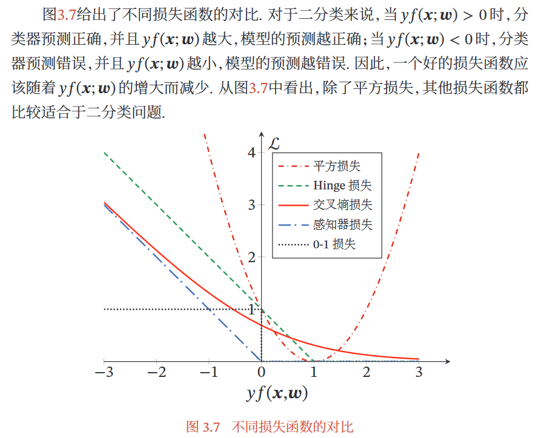

<FAQ title="习题2-1">

分析为什么平方损失函数不适用于分类问题。

</FAQ>

1. 对于特定的分类问题，平方差的损失有上限。
2. 在分类问题中，标签都是离散的，而且每个标签之间的距离也没有实际意义，预测值和标签之间的平方差无法反应分类问题的优化程度。
3. 分类问题的输出在经过sigmoid激活后，平方损失函数容易变成很复杂的非凸函数，不利于优化。

分类问题中一般使用交叉熵作为损失函数。

<FAQ title="习题2-2">

在线性回归中，如果我们给每个样本$(x^{(n)}, y^{(n)})$赋予一个权重$r^{(n)}$，经验风险函数为  

$$
R(w)=\frac 12 \sum_{n=1}^Nr^{(n)}(y^{(n)}-w^Tx^{(n)})^2
$$

计算其最优参数$w^*$，并分析权重$r^{(n)}$的作用。

</FAQ>
    

令$X=\begin{bmatrix}\boldsymbol{x^{(1)}} & \boldsymbol{x^{(2)}} & ... & \boldsymbol{x^{(n)}}\end{bmatrix},\  R=\begin{bmatrix} \sqrt{r^{(1)}} & & & \\ & \sqrt{r^{(2)}} & & & \\ & &  \ddots & \\ & & & \sqrt{r^{(n)}} \end{bmatrix}$

$$
R(w) = \frac 12 ||R(y-X^Tw)||_2^2 \\
\begin{aligned}
\frac {\partial{R(w)}}{\partial{w}} &= \frac 12 \frac{\partial{||R(y-X^Tw)||_2^2}}{\partial{w}} \\
& = XR(y-X^Tw) = 0 \\
\\ 
w^* &= (XRX^T)^{-1}XRy
\end{aligned}
$$

权重$r^{(n)}$表示对每个样本的重视程度不同。

<FAQ title="习题2-3">

证明在线性回归中，如果样本数量$N$小于特征数量$D+1$，则$XX^T$的秩最大为$N$。

</FAQ>

$$
r(XX^T) \le min\{r(X),r(X^T)\} \le N \\
即\ r(XX^T) \le N
$$

<FAQ title="习题2-4">

在线性回归中，验证岭回归的解为结构风险最小化准则下的最小二乘法估计，见公式(2.44)

$$
\begin{aligned}
R(w) &= \frac 12||y-X^Tw||^2+\frac 12||w||^2 \tag{2.44} \\
\end{aligned}
$$

$$
\begin{aligned}
w^* &= (XX^T+\lambda I)^{-1}Xy \tag{2.43} \\
\end{aligned}
$$

</FAQ>

$$
\begin{aligned}
\frac {\partial{R(w)}}{\partial w} &= \frac 12 {\partial{(||y-X^Tw||^2+\frac 12||w||^2)}}{\partial w} \\
&= -X(y-X^Tw)+\lambda w
\end{aligned}
$$

令$\frac {\partial{R(w)}}{\partial w}=0$

$$
XX^Tw+\lambda w = Xy \\
w^* = (XX^T+\lambda)^{-1}Xy
$$

得证。

<FAQ title="习题2-5">

在线性回归中，若假设标签$y \sim {\mathcal N}(w^Tx, \beta)$，并用最大似然估计来优化参数，验证最优参数为公式(2.52)的解。

$$
w^{ML}=(XX^T)^{-1}Xy \tag{2.52}
$$

</FAQ>

$$
log\ p(y|X;w,\sigma)=\sum_{n=1}^N \log {\mathcal N}(y^{(n)};w^Tx^{(n)},\sigma^2) \\
\begin{aligned}
\frac {\partial \log\ p(y|X;w,\sigma)}{\partial w} &= \sum_{n=1}^N \frac {\partial log\ \left( \frac{1}{\sqrt{2\pi \beta}} exp[-\frac {(y^{(n)}-w^Tx^{(n)})^2}{2\beta}] \right)}{\partial w} \\
&= -\frac 1{2\beta} \sum_{n=1}^N \frac {\partial(y^{(n)}-w^Tx^{(n)})^2}{\partial w} \\
&= -\frac 1{2\beta} \frac {\partial||y-X^Tw||^2}{\partial w} \\
&= -\frac 1{\beta} X(y-X^Tw) \\
\end{aligned}
$$

令$\frac {\partial \log\ p(y|X;w,\sigma)}{\partial w}=0$，得

$$
w=(XX^T)^{-1}Xy
$$

得证。

<FAQ title="习题2-6">

假设有$N$个样本$x^{(1)},x^{(2)},...,x^{(N)}$服从正态分布${\mathcal N}(\mu, \sigma^2)$，其中$\mu$未知。
1)使用最大似然估计来求解最优参数$\mu^{ML}$；
2)若参数$\mu$为随机变量，并服从正太分布${\mathcal N}(\mu_0,\sigma_0^2)$，使用最大后验估计来求解最优参数$\mu^{MAP}$。

</FAQ>

(1)令$\frac {\partial \sum_{n=1}^N \log {\mathcal N}(y^{(n)};\mu,\sigma^2)}{\partial \mu}=0$

$$
\frac {\partial \sum_{n=1}^N \log \frac {1}{\sqrt{2\pi}\sigma} exp\left(-\frac {(y^{(n)}-\mu)^2}{2\sigma^2}\right)}{\partial \mu}=0 \\
\sum_{n=1}^N(y^{(n)}-\mu)=0 \\
\mu=\frac 1N\sum_{n=1}^Ny^{(n)}
$$

(2)

$$
p(w|X,y;\sigma_0,\sigma) \propto p(y|X,\mu;\sigma)p(\mu_0;\sigma_0) \\
\log p(w|X,y;\sigma_0,\sigma) \propto \log p(y|X,\mu;\sigma)+\log p(\mu_0;\sigma_0) \\
\log p(w|X,y;\sigma_0,\sigma) \propto \sum_{n=1}^N \log {\mathcal N}(y^{(n)};\mu,\sigma)+\log {\mathcal N}(\mu_0;\sigma_0)
$$

令$\frac {\partial {\log p(w|X,y;\sigma_0,\sigma)}}{\partial \mu}=0$

$$
\frac {\partial \left(\sum_{n=1}^N \log \frac {1}{\sqrt{2\pi}\sigma} exp\left(-\frac {(y^{(n)}-\mu)^2}{2\sigma^2}\right)+\log \frac {1}{\sqrt{2\pi}\sigma_0} exp\left(-\frac {(\mu-\mu_0)^2}{2\sigma_0^2}\right) \right)}{\partial \mu}=0 \\
\frac {\partial \left(\sum_{n=1}^N \left(-\frac {(y^{(n)}-\mu)^2}{2\sigma^2}\right)+\left(-\frac {(\mu-\mu_0)^2}{2\sigma_0^2}\right) \right)}{\partial \mu}=0 \\
\frac 1{\sigma^2}\sum_{n=1}^N(y^{(n)}-\mu)-\frac 1{\sigma_0^2}(\mu-\mu_0)=0 \\
\mu=\frac {\sigma_0^2\sum_{n=1}^Ny^{(n)}+\sigma^2\mu_0}{\sigma_0^2N+\sigma^2}
$$

<FAQ title="习题2-7">

在习题2-6中，证明当$N\to \infty$时，最大后验估计趋向于最大似然估计。

</FAQ>

易证

$$
\lim_{N \to \infty}\frac {\sigma_0^2\sum_{n=1}^Ny^{(n)}+\sigma^2\mu_0}{\sigma_0^2N+\sigma^2} = \frac 1N\sum_{n=1}^Ny^{(n)}
$$

<FAQ title="习题2-8">

验证公式(2.61)。

$$
f^*(x) = {\Bbb E}_{y \sim p_r(y|x)}[y] \tag{2.61}
$$

</FAQ>

已知

$$
\begin{aligned}
{\mathcal R}(f)={\Bbb E}_{(x,y)\sim p_r(x.y)}[(y-f(x))^2] \tag{2.60} \\
\end{aligned}
$$

$$
{\mathcal R}(f) = \int\int (y-f(x))^2p(x,y)dxdy
$$

这里引入变分法，先介绍几个概念，**泛函是以函数为变量的函数，求泛函极值的方法称为变分法**。

$$
F(y) = \int_a^b f(x,y,y')dx \\
\begin{aligned}
\delta F&= F(y+\delta y) - F(y) \\
 &= \int_a^b \left( \frac{\partial f}{\partial y} - \frac{d}{dx} \left( \frac{\partial f}{\partial y'} \right) \right) \delta y dx
\end{aligned}
$$

则Euler方程为

$$
\frac{\partial f}{\partial y} - \frac{d}{dx}\left ( \frac{\partial f}{\partial y'} \right ) = 0
$$

这里的泛函为${\mathcal R}(f)$，令$H(x,y)=\int (y-f(x))^2p(x,y)dy$求得

$$
\frac {\partial H}{\partial f} = \int 2(f(x)-y)p(x,y)dy,\ \frac {\partial H}{\partial f'} = 0 \\
$$

带入Euler方程，得

$$
\int 2(f(x)-y)p(x,y)dy = 0 \\
\int (f(x)-y)p(x,y)dy-\int yp(x,y)dy=0 \\
f(x) = \frac {\int yp(x,y)dy}{p(x)} \\
f(x) = \int yp(y|x)dy
$$

得证。

<FAQ title="习题2-9">

试分析什么因素会导致模型出现图2.6所示的高偏差和高方差情况。

</FAQ>

训练数据少且分布不均匀。

<FAQ title="习题2-10">

验证公式(2.66)。

$$
{\Bbb E}_D[(f_D(x)-f^*(x))^2]=\left( {\Bbb E}_D[f_D(x)]-f^*(x) \right)^2+{\Bbb E}_D[\left( f_D(x)-{\Bbb E}_D[f_D(x)] \right)^2] \tag{2.66}
$$

</FAQ>

$$
\begin{aligned}
{\Bbb E}_D[(f_D(x)-f^*(x))^2] &= {\Bbb E}_D[(f_D(x)-{\Bbb E}_D[f_D(x)]+{\Bbb E}_D[f_D(x)]-f^*(x))^2] \\
&={\Bbb E}_D[\left( {\Bbb E}_D[f_D(x)]-f^*(x) \right)^2]+{\Bbb E}_D[\left( f_D(x)-{\Bbb E}_D[f_D(x)] \right)^2] \\
&\ \ +2{\Bbb E}_D[({\Bbb E}_D[f_D(x)]-f^*(x))(f_D(x)-{\Bbb E}_D[f_D(x)])] \\
\end{aligned}
$$

其中第一项${\Bbb E}_D[\left( {\Bbb E}_D[f_D(x)]-f^*(x) \right)^2]=\left( {\Bbb E}_D[f_D(x)]-f^*(x) \right)^2$，第二项即为要证公式的第二项。
对第三项

$$
\begin{aligned}
&{\Bbb E}_D[({\Bbb E}_D[f_D(x)]-f^*(x))(f_D(x)-{\Bbb E}_D[f_D(x)])] \\
&\ \ ={\Bbb E}_D[f_D(x){\Bbb E}_D[f_D(X)]]-({\Bbb E}_D[f_D(x)])^2-f^*(x)f_D(x)+f^*(x){\Bbb E}_D[f_D(x)]] \\
&\ \ =({\Bbb E}_D[f_D(x)])^2-({\Bbb E}_D[f_D(x)])^2-f^*(x){\Bbb E}_D[f_D(x)]+f^*(x){\Bbb E}_D[f_D(x)] \\
&\ \ =0
\end{aligned}
$$

得证。

<FAQ title="习题2-11">

分别用一元、二元和三元特征的词袋模型表示文本“我打了张三”和“张三打了我”，分析不同模型的优点。

</FAQ>

1. 一元：特征单元有：“我”“打了”“张三”

	$$
	x_1=[1\ 1\ 1]^T \\
	x_2=[1\ 1\ 1]^T
	$$
	
	两个文本表示相同，无法表示语序信息。

2. 二元：特征单元有：“\$我”“我打了”“打了张三”“张三#”“\$张三”“张三打了”“打了我”“我#”

	$$
	x_1=[1\ 1\ 1\ 1\ 0\ 0\ 0\ 0]^T \\
	x_2=[0\ 0\ 0\ 0\ 1\ 1\ 1\ 1]^T
	$$
	
	能够表示相邻两个词之间的语序特征，但向量的大小也会增加。

3. 三元：特征单元有：“\$ \$我”“\$我打了”“我打了张三”“打了张三#”“张三##”“\$ \$张三”“\$张三打了”“张三打了我”“打了我#”“我##”

	$$
	x_1=[1\ 1\ 1\ 1\ 1\ 0\ 0\ 0\ 0\ 0]^T \\
	x_2=[0\ 0\ 0\ 0\ 0\ 1\ 1\ 1\ 1\ 1]^T
	$$
	
	能表示相邻三个词之间的语序特征。当文本很多时，n越大，向量将会越稀疏。

	
<FAQ title="习题2-12">

对于一个三分类问题，数据集的真实标签和模型的预测标签如下：

$$
\begin{aligned}
&真实标签 \quad 1 \quad 1 \quad 2 \quad 2 \quad 2 \quad 3 \quad 3 \quad 3 \quad 3 \\
&预测标签 \quad 1 \quad 2 \quad 2 \quad 2 \quad 3 \quad 3 \quad 3 \quad 1 \quad 2 
\end{aligned}
$$

分别计算模型的精确率、召回率、F1值以及它们的宏平均和微平均。

</FAQ>
	
精确率：

$$
P_1=\frac {TP_1}{TP_1+FP_1} =\frac {1}{1+1} =\frac 12,\quad P_2=\frac {TP_2}{TP_2+FP_2} =\frac {2}{2+2} =\frac 12,\quad 
P_3=\frac {TP_3}{TP_3+FP_3} =\frac {2}{2+1} =\frac 23 \\
R_1=\frac {TP_1}{TP_1+FN_1} =\frac {1}{1+1} =\frac 12,\quad 
R_2=\frac {TP_2}{TP_2+FN_2} =\frac {2}{2+1} =\frac 23,\quad 
R_3=\frac {TP_3}{TP_3+FN_3} =\frac {2}{2+2} =\frac 12 \\
F1_1=\frac {2P_1R_1}{P_1+R_1} =\frac 12,\quad 
F1_2=\frac {2P_2R_2}{P_2+R_2} =\frac 47,\quad 
F1_3=\frac {2P_3R_3}{P_3+R_3} =\frac 47 
$$

宏平均是每一类的性能指标的算术平均值

$$
P_{macro} = \frac 1C \sum_{c=1}^CP_c = \frac 59 \\
R_{macro} = \frac 1C \sum_{c=1}^CR_c = \frac 59 \\
F1_{macro} = \frac {2P_{macro}R_{macro}}{P_{macro}+R_{macro}} = \frac 59 
$$

微平均是每一个样本的性能指标的算术平均值

$$
P_{micro} = \frac 1N \sum_{n=1}^NP_n = \frac 59 \\
R_{micro} = \frac 1N \sum_{n=1}^NR_n = \frac 59 \\
F1_{micro} = \frac 1N \sum_{n=1}^NF1_n = \frac 59 \\
$$
